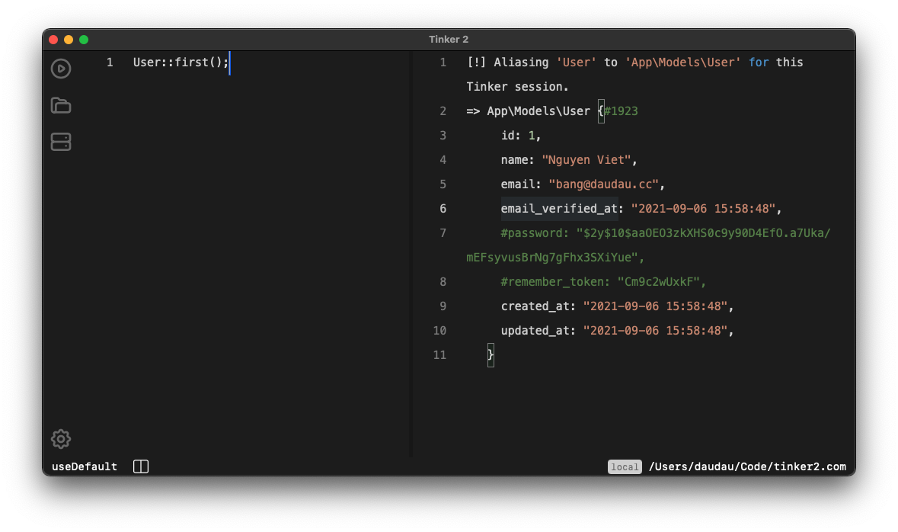

# Tinker 2

The source code of https://tinker2.com product.

Tinker 2 helps you tinker with your any PHP application without without touching source code (locally or via SSH)

Tinker 2 is small (less than 10MB on MacOS).

## Getting started

Tinker 2 doesn't ship with any default `Laravel` framework, which increase unnecessary app size. You should create an dummy project to set as inital project when open Tinker 2 (So you can have full control about what can be installed by default).

## Frameworks supported

-   [x] Laravel
-   [x] Wordpress
-   [ ] Prestasop
-   [ ] Magento
-   [x] Normal PHP project (with composer)

